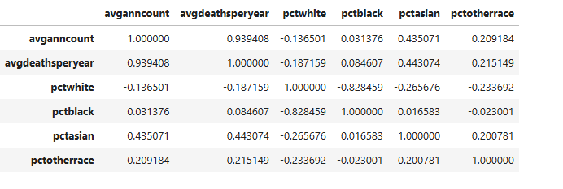
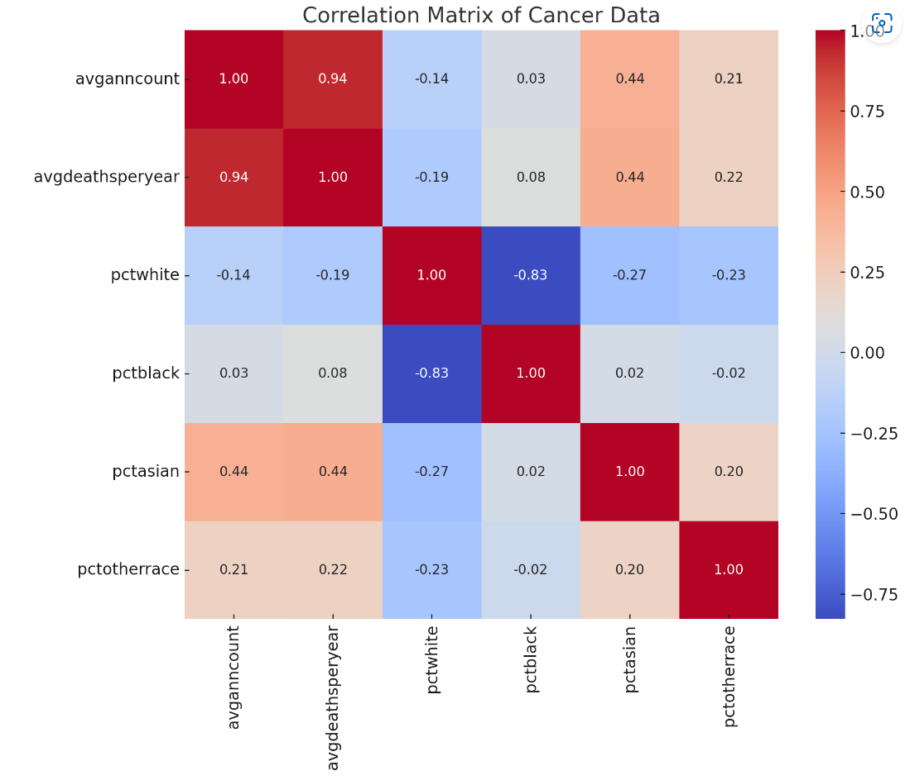

# About The Project
> GitHub README file includes a concise project overview.

This project performs an exploratory data analysis on a Kaggle dataset that includeds an abundant set of socioeconomic and demographic factors.
The analysis will examine how these factors influence health outcomes.

# Getting Started
> GitHub README file includes detailed usage and installation instructions.

## Installation

### For Unix (Linux/MacOS)

1. Open your terminal.
2. Run the following command:
```bash
git clone https://github.com/jordanskesner/plotters-against-cancer.git
```

## Usage
1. Start Jupyter Notebook from the project directory.
2. Open the relevant `.ipynb` notebook files to explore and run the analysis.

## Findings

> Reviewing the data provided in the population estimates of 2015 which included referencing the average annual count of cancer cases with different racces shed the following results as follow: 
>  1. The correlation coefficient between avganncount (average annual cancer count) and pctwhite (percentage of the population that is White) is approximately -0.14. 
>     This indicates a weak negative correlation. The weak negative correlation between avganncount and pctwhite suggests that there is a slight tendency for counties with higher
>     percentages of White populations to have lower average annual cancer counts.  
>     Besides the negative correlation, based on how the data was group and collected; it is possible that the data could be Skewed data. 
>     Additional reseach on the data may be needed.  
>     As an example:  In California, the white race percentage includes also Hispanic/Latinos. Therefore the data can be skewed.
>
>  2. The correlation coefficient between avganncount (average annual cancer count) and pctblack (percentage of the population that is Black) is approximately 0.03.
>     This indicates an extremely weak positive correlation between these two variables.
>     The extremely weak positive correlation between avganncount and pctblack indicates that there is no meaningful relationship between these two variables in the dataset.
>     The percentage of the Black population in a county does not have a significant impact on the average annual cancer count, suggesting that other factors are likely more important in influencing cancer incidence.
>
>  3. The correlation coefficient between avganncount (average annual cancer count) and pctasian (percentage of the population that is Asian) is approximately 0.44. 
>     This indicates a moderate positive correlation between these two variables.
>     The moderate positive correlation between avganncount and pctasian indicates that there is a fairly consistent relationship between the percentage of the Asian population in a county and the average annual cancer count.
>     This could suggest that in counties with larger Asian populations, cancer incidence tends to be higher. This finding could warrant further investigation to understand the underlying factors contributing to this relationship, 
>     such as genetic, environmental, or socioeconomic influences.
>     At the same time, the Asian population is incredibly diverse, comprising many different groups and subcultures, which necessitates a more detailed statistical analysis. 
>     Futher researh needs to be consider.
>
>  4. The correlation coefficient between avganncount (average annual cancer count) and pctotherrace (percentage of the population that is classified as other races) is approximately 0.21. 
>     This indicates a weak positive correlation between these two variables. 
>     The weak positive correlation between avganncount and pctotherrace suggests that counties with higher percentages of populations classified as other races may have slightly higher average annual cancer counts. 
>     However, this relationship is not strong, indicating that the percentage of other races in a population is likely not a major determinant of cancer incidence.
>     Other factors are likely to have a more significant impact on cancer rates. Further research could explore what factors might be contributing to this weak correlation and subclasify the other races.
  
##  Correlation Matrix Data of Cancer Data by Race


## Heatmap of Correlation Matrix Data of Cancer Data by Race


> GitHub README includes either examples of the application, or the results and a summary of the analysis

# Acknowledgments

This project utilizes the [Uncovering Trends in Health Outcomes and Socioeconomic Factors dataset](https://www.kaggle.com/datasets/thedevastator/uncovering-trends-in-health-outcomes-and-socioec/data) available on Kaggle.

# Contributors


